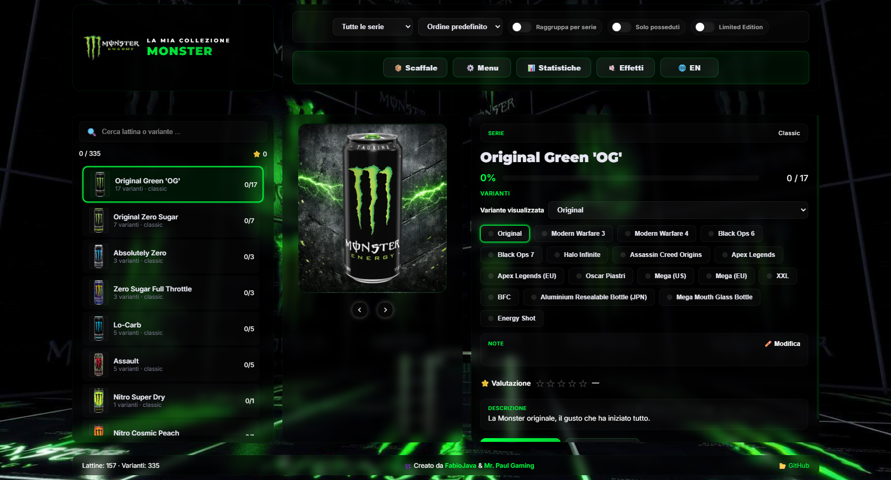
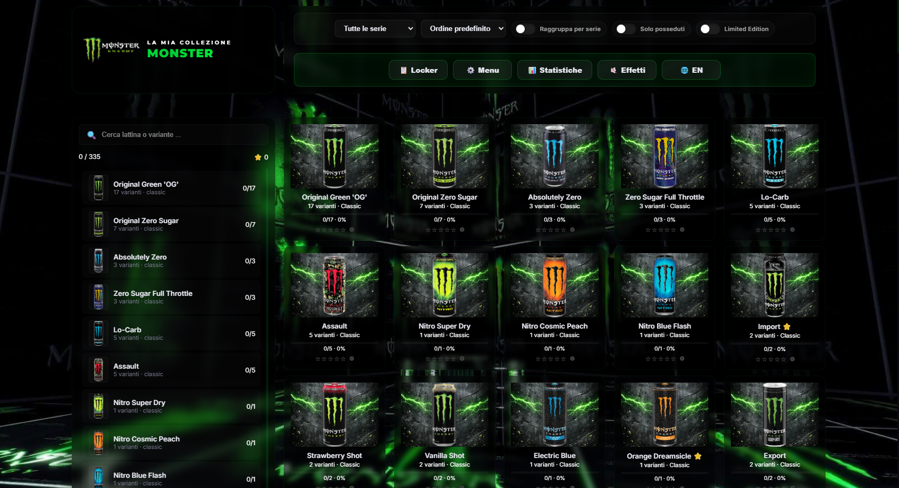

# Monster Energy Tracker

Tracker locale per collezionisti di lattine Monster Energy. L'applicazione permette di catalogare lattine e varianti, segnare quelle possedute, aggiungere una valutazione e conservare note personali. Tutti i dati della collezione restano nel browser dell'utente e possono essere esportati in JSON.



## Indice

- [Panoramica](#panoramica)
- [Funzionalita](#funzionalita)
- [Anteprima](#anteprima)
- [Avvio](#avvio)
- [Guida rapida](#guida-rapida)
- [Persistenza e backup](#persistenza-e-backup)
- [Catalogo e modello dati](#catalogo-e-modello-dati)
- [Architettura](#architettura)
- [Struttura del progetto](#struttura-del-progetto)
- [Personalizzazione e sviluppo](#personalizzazione-e-sviluppo)
- [Limitazioni note](#limitazioni-note)
- [Contributi](#contributi)

## Panoramica

Il progetto e una single-page application statica, senza backend e senza fase di build. La UI, gli stili e il runtime sono contenuti in `index.html`; il catalogo iniziale e definito in `catalog.js` e gli helper per l'import/export del catalogo sono in `catalog-manager.js`.

Il catalogo incluso contiene **154 schede**, **245 varianti** e **11 serie**:

- Classic
- Ultra
- Juice
- Java
- Rehab
- Reserve
- Special Edition
- Hydro
- Muscle
- Beast Unleashed
- Dragon Tea

## Funzionalita

### Gestione della collezione

- Selezione di una scheda dalla lista laterale.
- Stato posseduto/non posseduto per ogni variante.
- Azioni `Acquisisci tutte` e `Cancella tutte` per la scheda corrente.
- Indicatore percentuale e contatore per scheda.
- Contatori globali nel pannello laterale e nel footer.
- Evidenza delle edizioni `Limited`.

### Ricerca, filtri e ordinamento

- Ricerca testuale per nome della lattina.
- Filtro per serie.
- Filtro `Solo posseduti`.
- Filtro `Limited Edition`.
- Raggruppamento per serie.
- Ordinamento predefinito, nome A-Z/Z-A, completamento e valutazione.

### Due viste

- **Locker**: dettaglio della scheda corrente, immagine, serie, varianti, note, valutazione e descrizione.
- **Scaffale**: griglia compatta delle schede filtrate, con immagine, serie, completamento e stelle. Nella vista Scaffale, passando il mouse su una scheda le varianti escono a ventaglio dietro la lattina principale; un click su una variante apre la vista Locker con quella variante già selezionata. Su dispositivi touch lo stesso effetto si ottiene con un tap.

Il passaggio tra Locker e Scaffale è integrato con la cronologia del browser: i tasti Indietro e Avanti tornano alla vista e alla posizione di scroll precedenti.

### Note e valutazioni

Ogni variante conserva una valutazione da 1 a 5 stelle e una nota libera. Le note sono modificabili dal pulsante `Modifica` nel pannello della scheda; la descrizione del catalogo e invece sola lettura.

### Import, export e immagini

Dal menu sono disponibili:

- esportazione dei progressi in `monster_collection.json`;
- importazione dei progressi da un file JSON;
- esportazione del catalogo in `monster-catalog.json`;
- importazione di un catalogo personalizzato;
- esportazione PNG dell'intera collezione, delle sole lattine mancanti o della scheda corrente;
- reset completo dei progressi, con conferma.

### Audio e interazione

- Effetti sonori per le interazioni.
- Musica di sottofondo opzionale.
- Suoni speciali associati ad alcune lattine.
- Animazione di sfondo durante la riproduzione musicale.
- Layout responsive con lista collassabile su schermi piccoli.
- Sfondo e logo contestuali alla serie selezionata.

## Anteprima

### Vista Locker

La vista Locker e pensata per lavorare su una scheda alla volta: mostra l'immagine grande della lattina, lo stato di completamento, le varianti e i metadati personali.


### Vista Scaffale

La vista Scaffale offre una panoramica visuale della collezione filtrata e consente di confrontare rapidamente completamento e valutazione delle schede.



## Avvio

### Requisiti

- Browser moderno con supporto a JavaScript, `localStorage` e download Blob: Chrome, Edge, Firefox o Safari aggiornati.
- Connessione internet consigliata per i font Google, `html2canvas` e il fallback della musica.
- Nessuna installazione di Node.js necessaria per usare l'app.

### Apertura diretta

Aprire `index.html` nel browser. Per un'esperienza piu affidabile, soprattutto per audio e caricamento degli asset, e preferibile usare un server locale.
In alternativa è possibile utilizzare per uso personale questo sito web: [monster.fabiojava.it]

### Server locale

Con Python:

```bash
python -m http.server 8000
```

Poi visitare <http://localhost:8000>.

In alternativa e possibile usare l'estensione VS Code **Live Server** o qualunque server statico equivalente.

## Guida rapida

1. Aprire l'app e selezionare una lattina dalla lista a sinistra.
2. Usare i pulsanti delle varianti per segnare quelle possedute.
3. Aggiungere una valutazione e, se necessario, una nota personale.
4. Usare ricerca, serie, ordinamento e toggle per restringere la lista.
5. Passare a `Scaffale` per una panoramica visuale.
6. Aprire `Menu` e usare `Esporta JSON` per creare un backup.

### Scorciatoie da tastiera

| Tasto | Azione |
|---|---|
| `Freccia sinistra` | Scheda precedente |
| `Freccia destra` | Scheda successiva |
| `Freccia su` | Variante successiva |
| `Freccia giu` | Variante precedente |
| `Spazio` | Acquisisce tutte le varianti della scheda corrente |
| `G` | Alterna Locker e Scaffale |
| `S` | Apre Statistiche |
| `M` | Apre Menu |
| `C` | Porta il focus sulla barra di ricerca |
| `E` | Attiva/disattiva musica ed effetti sonori |
| `Esc` | Chiude il menu o annulla la modifica del campo attivo |

Le scorciatoie non vengono applicate mentre il focus e dentro un campo di testo, una select o l'editor delle note.

## Persistenza e backup

L'app non invia i progressi a un server. Usa due aree di `localStorage`:

| Chiave | Contenuto |
|---|---|
| `monster_tracker_v2` | Possesso, valutazioni, note e data dell'ultimo aggiornamento |
| `monster_tracker_ui` | Filtri, ordinamento, vista attiva, scheda corrente e variante selezionata |

Il backup dei progressi e un oggetto JSON indicizzato dagli ID delle schede. L'importazione verifica che il file contenga almeno una chiave riconosciuta e poi ricarica la UI. Il caricamento dello stato normalizza i campi mancanti e migra automaticamente il precedente formato in cui una variante era rappresentata da un semplice booleano.

Per sicurezza, esportare periodicamente il file JSON prima di modificare il catalogo o cancellare i dati del browser.

## Catalogo e modello dati

Il catalogo iniziale e l'array globale `window.MONSTER_CATALOG_DATA` in `catalog.js`. Ogni elemento ha questa forma:

```json
{
	"id": "monster_example",
	"name": "Example",
	"image": "assets/monster/classic/example.png",
	"series": "classic",
	"rarity": "rare",
	"limited": false,
	"description": "Descrizione della scheda.",
	"variants": ["Original", "Zero Sugar"],
	"variantImages": {
		"Zero Sugar": "assets/monster/classic/example-zero.png"
	}
}
```

Campi obbligatori per l'importazione del catalogo: `id`, `name`, `description`, `rarity` e `variants`. `image` e l'immagine principale; `variantImages` permette di associare un asset specifico a una variante. `limited` indica un'edizione limitata e `series` determina sfondo e logo contestuali.

`catalog-manager.js` espone `window.MonsterCatalog`, con i metodi `set`, `toJSON`, `download` e `importFile`. Questo rende possibile aggiornare il catalogo senza modificare la logica della UI.

## Architettura

```text
index.html
	├── struttura HTML e stili CSS
	├── stato della collezione e rendering UI
	├── filtri, ricerca, viste e statistiche
	├── import/export progressi e immagini
	└── gestione audio e scorciatoie

catalog.js
	└── dati statici delle schede e delle varianti

catalog-manager.js
	└── validazione, serializzazione e import/export del catalogo

assets/
	├── monster/   immagini delle schede e delle varianti
	├── ui/        sfondi, frecce e animazioni
	├── icons/     loghi principali e loghi per serie
	└── audios/    musica ed effetti locali
	└── videos/    video usati
```

La pagina carica `html2canvas` da CDN per generare i PNG. Il catalogo e i dati di stato sono separati: modificare `catalog.js` non dovrebbe cancellare una collezione gia salvata, mentre un import del catalogo puo aggiungere o rimuovere le schede disponibili.

## Struttura del progetto

```text
monster-collector/
├── index.html
├── catalog.js
├── catalog-manager.js
├── README.md
├── screenshots/
│   ├── locker-view.png
│   └── grid-view.png
└── assets/
		├── audios/
		├── icons/
		├── monster/
		│   ├── beast/
		│   ├── classic/
		│   ├── dragon/
		│   ├── hydro/
		│   ├── java/
		│   ├── juice/
		│   ├── muscle/
		│   ├── rehab/
		│   ├── reserve/
		│   ├── special/
		│   └── ultra/
		└── ui/
```

## Personalizzazione e sviluppo

### Aggiungere una scheda

1. Inserire l'immagine in una cartella di `assets/monster/`.
2. Aggiungere un oggetto all'array di `catalog.js`.
3. Inserire le varianti in `variants`.
4. Usare `variantImages` solo quando una variante richiede un'immagine distinta.
5. Ricaricare l'app e verificare filtri, navigazione e immagini.

### Aggiungere una serie

Per una nuova serie occorre aggiornare sia l'opzione in `#filter-series`, sia le mappe `CATEGORY_BG_MAP` e `CATEGORY_LOGO_MAP` in `index.html`, oltre ad aggiungere gli asset corrispondenti.

### Verifica manuale consigliata

- apertura con catalogo vuoto;
- selezione e possesso di singole varianti;
- note e valutazioni;
- filtri combinati e ordinamento;
- cambio Locker/Scaffale;
- export e re-import dei progressi;
- import di un catalogo valido e di uno non valido;
- esportazione PNG;
- layout mobile e scorciatoie.

## Limitazioni note

- I dati sono locali al browser e non vengono sincronizzati tra dispositivi.
- La cancellazione dei dati del sito elimina la collezione se non e stato creato un backup JSON.
- Font, `html2canvas` e il fallback musicale dipendono da risorse esterne quando non sono disponibili localmente.
- Il browser puo richiedere una prima interazione dell'utente prima di consentire la riproduzione audio.
- Il progetto non include test automatici o una pipeline di build.

## Contributi

Per proporre modifiche:

1. Creare un fork del progetto.
2. Creare un branch descrittivo.
3. Mantenere compatibili i percorsi degli asset e il formato del catalogo.
4. Verificare manualmente le funzionalita elencate sopra.
5. Aprire una pull request con una descrizione e, quando utile, uno screenshot.

## Licenza e asset

Il progetto e un catalogo amatoriale per uso personale. I marchi, i loghi e le immagini Monster Energy appartengono ai rispettivi proprietari. Verificare i diritti d'uso degli asset prima di distribuire una versione pubblica o commerciale.
